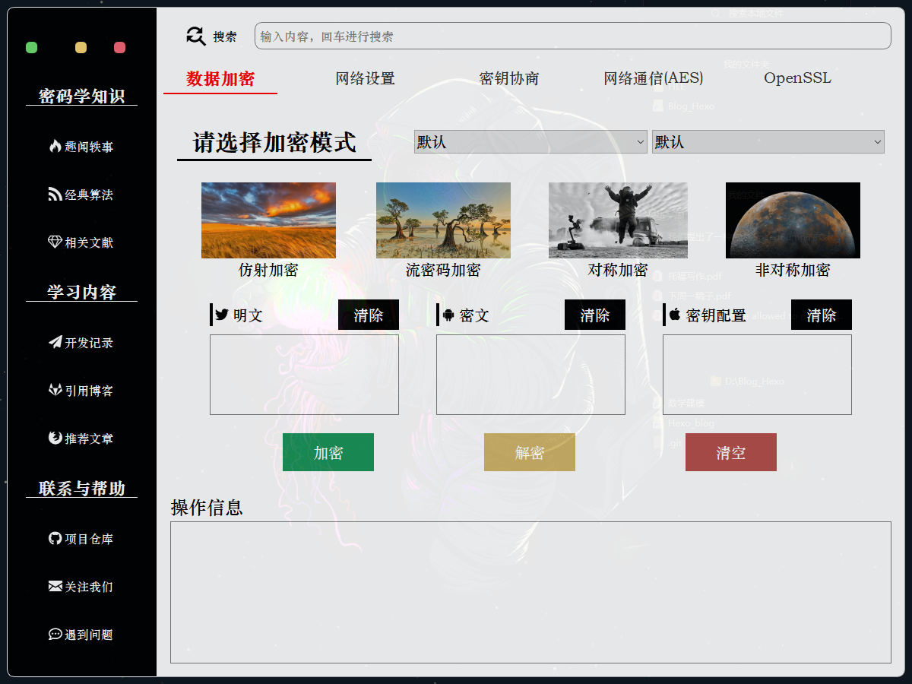

# End-to-End Encrypted Client-Server Communication Application

:gear: Try it now! Download it locally.

```bash
$ git clone https://github.com/Dominique-Yiu/cryptology_exp.git
```

## Certificate Generation
Before running our application program, try to generate certificate first using openssl.

```bash
$ mkdir cert/ && cd cert/
# generate CA private key
$ openssl genrsa -out ca.key 2048

# generate a self-signed CA certificate
$ openssl req -new -x509 -days 3650 -key ca.key -out ca.crt -subj "/C=CN/ST=hunan/L=changsha/O=HNU/OU=csee/CN=CA_zino"

# generate the server private key
$ openssl genrsa -out server.key 2048

# generate a certificate signing request
$ openssl req -new -key server.key -out server.csr -subj "/C=CN/ST=hunan/L=changsha/O=HNU/OU=csee/CN=127.0.0.1"

# sign the certificate signing request with the CA certificate
$ openssl x509 -req  -days 3650 -in server.csr -CA ca.crt -CAkey ca.key -set_serial 01 -out server.crt

# verify test
$ openssl  verify  -CAfile  ca.crt  server.crt

$ cd ..
```

## Run Software
```bash
$ python src/main.py
```
After running code above, the application looks like below.
<div align='center'>
    
</div>
